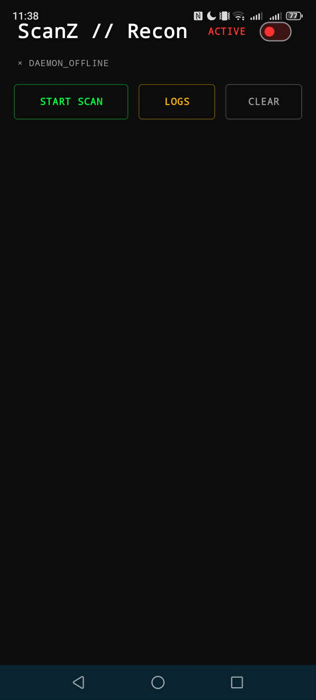
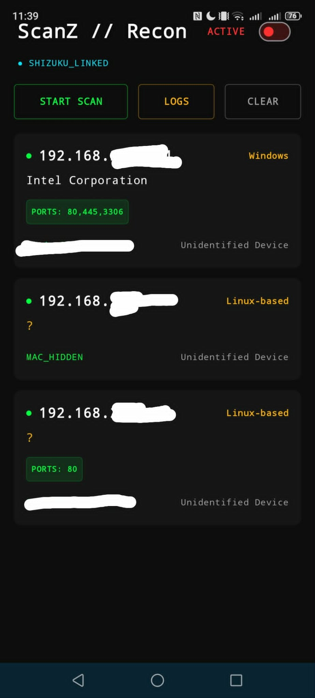

# ScanZ // Advanced Android Network Reconnaissance

**Leverage Shizuku to bypass Android 11+ sandboxing for stealthy Layer-2 network reconnaissance.**

## 🔍 Overview
Since Android 11, the OS strictly sandboxes applications, effectively blinding traditional mobile scanners. ScanZ bridges this gap. By establishing a high-privilege Binder IPC connection via Shizuku, ScanZ queries the network directly as the `shell` user, bringing powerful Layer-2 and Layer-3 discovery back to unrooted Android devices.

---

## 🛡️ Core Features

### Layer-2 Intelligence
* **ARP Cache Mining:** Parses the system ARP table via Shizuku to resolve authentic MAC addresses.
* **O(1) OUI Resolver:** Instant hardware vendor identification using an optimized hash-map dictionary.
* **Privacy-MAC Detection:** Algorithmic detection of randomized/private MAC addresses (the "2, 6, A, E" rule) to identify mobile targets.

### Layer-3 Reconnaissance
* **Passive OS Fingerprinting:** Infers target operating systems (Linux, Windows, iOS, Android) via ICMP TTL analysis.
* **Service Banner Grabbing:** Asynchronous raw socket probing to pull service headers (SSH, HTTP, etc.) from open ports.

### Tactical & CTF-Ready
* **OPSEC IDS Engine:** Calculates a real-time "IDS Flag Probability" score based on the noise level of your active probes.
* **Stealth Mode:** Disables all active scanning, relying exclusively on passive mDNS listening and ARP cache resolution.
* **Persistent Tagging:** High-performance Room database for tracking subnet deltas and custom device tagging.

---

## 🛠️ Architecture: Under the Hood

### Privilege Escalation
ScanZ utilizes a **Sticky Listener pattern** combined with Shizuku's `newProcess` execution. Unlike standard apps that run under restricted UIDs, ScanZ communicates with the Shizuku daemon via a customized `ShizukuBinderWrapper`. This allows the application to execute native Linux binaries like `ip neigh show` and capture raw stdout streams, bypassing the Android Framework's API restrictions.

### The Engine
* **Asynchronous Probing:** Built on Kotlin Coroutines for non-blocking, low-latency concurrent port checks.
* **Reflection-Based Execution:** Uses Kotlin reflection to interact with Shizuku v13+ private methods, ensuring long-term compatibility for Layer-2 data extraction.

---

## 🚀 Prerequisites & Installation

### 1. Requirements
* **Shizuku:** You must have [Shizuku](https://shizuku.rikka.app/) installed and running on your device (via ADB or Wireless Debugging) for the Layer-2 features to function.
* **OS:** Android 7.0+ (Supports API 24 through API 35).

### 2. Installation
ScanZ is distributed as both pre-compiled binaries and source code for security auditing. 

* **⬇️ Download APK:** The latest compiled APKs are available exclusively in the **[GitHub Releases Tab](https://github.com/CyBaiSecurity/ScanZ/releases)**. Do not look for `.apk` files in the main source branch.
* **💻 Build from Source:** Clone this repository and compile via Android Studio. On first launch, authorize ScanZ when prompted by the Shizuku manager.

---

## ⚖️ Disclaimer
ScanZ is intended for authorized security auditing, educational purposes, and professional penetration testing only. The authors are not responsible for any misuse of this tool. Unauthorized scanning of networks without explicit permission is illegal and unethical.

*Maintained by **CyBaiSecurity / Dave Lazarte***